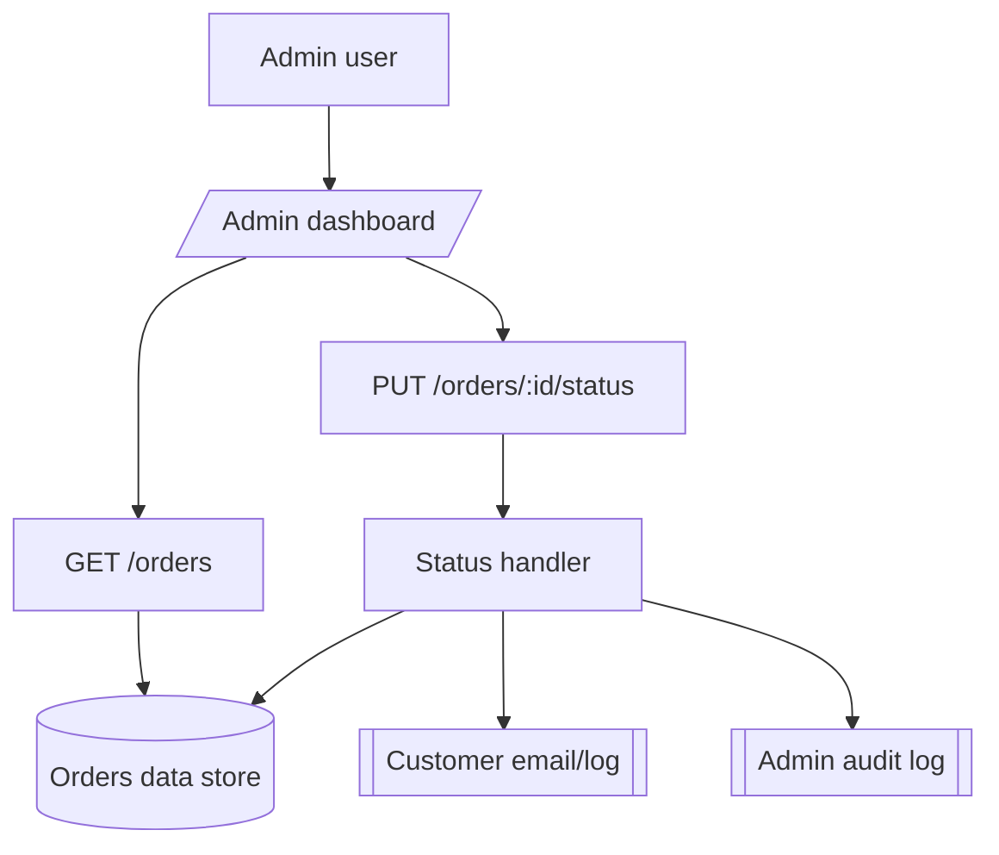
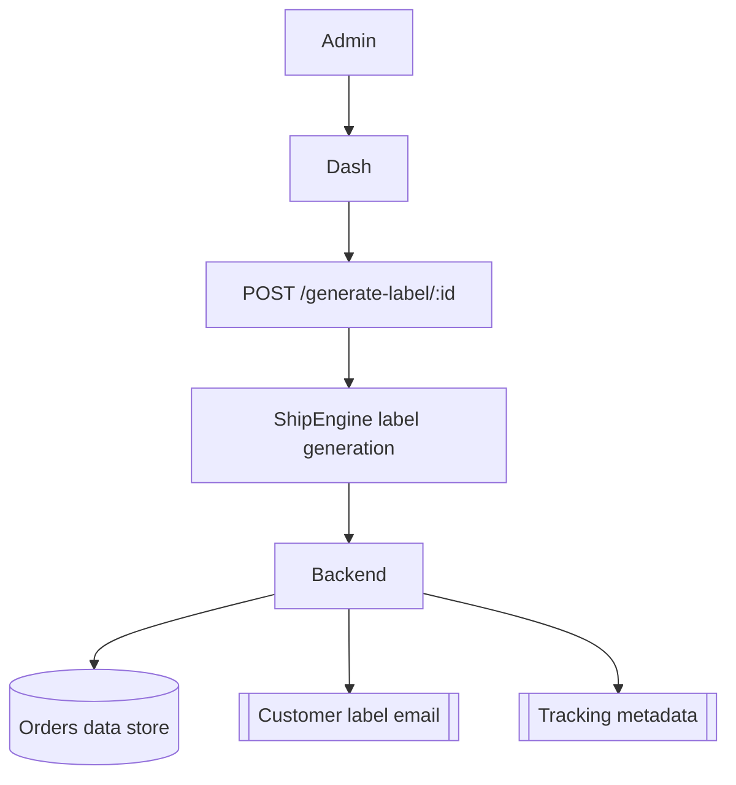
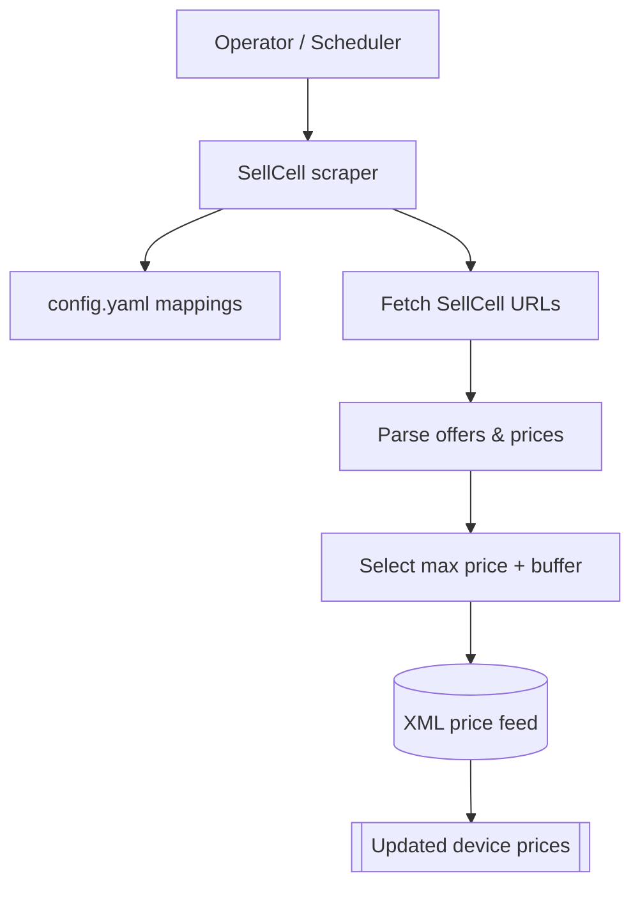

# System Overview

## Top-level Summary
- Device owners can browse marketing content, chat with support, and request instant buyback quotes that submit orders, capture shipping preferences, and trigger notification workflows backed by the hosted APIs.
- The consumer order flow stores full device, shipping, payment, and status information, generates sequential order numbers, and mirrors records into user-specific subcollections for later access.
- Administrators operate dashboards that read and update orders, trigger customer communications, void or generate shipping labels, and manage wholesale inventory, with extensive email, push notification, and audit logging hooks.
- High-risk integrations include ShipEngine/ShipStation for label generation and tracking, Stripe for wholesale payments, outbound email delivery via hosted mail accounts, and Zendesk for support ticketing.

## Route Inventory
| Path | Type | Purpose | Auth Required | Data Sources Touched | Key Files | Migration Complexity (1–5) |
| --- | --- | --- | --- | --- | --- | --- |
| `/` | public | Marketing landing with live chat, contact forms, and account controls tied to hosted auth. | Optional for chat messaging | Firestore chats, orders, local storage |  | 4 |
| `/sell/` | public | Interactive quote builder that loads device catalogs, collects condition info, and submits orders to the backend. | Optional (encouraged login) | Firestore device catalog, `/submit-order` API |  | 4 |
| `/sell-device.html` | public | Alternative sell experience with themed styling and shared auth/quote components. | Optional | Same as `/sell/` |  | 3 |
| `/reoffer-action.html` | public dynamic | Customer-facing decision page for revised offers with accept/return actions and buyer replies. | Required (prompts for login) | `/orders/{id}`, `/accept-offer-action`, `/return-phone-action` APIs |  | 4 |
| `/buy/` | public | Wholesale catalog loader that syncs remote inventory into local storage for cart experiences. | Optional | `/wholesale/inventory` API, local storage |  | 3 |
| `/buy/cart.html`, `/buy/checkout.html`, `/buy/order-submitted.html` | public dynamic | Cart management, checkout capture, and confirmation views for wholesale buyers. | Requires account for checkout | `/wholesale/orders/checkout`, local cart storage |  | 4 |
| `/login.html`, `/reset-password.html`, `/my-account.html` | public | Account management, authentication, and order history display for consumers. | Yes for account data | Firestore users, `/orders/by-user/:userId` API |  | 3 |
| `/admin/` | admin | Order management dashboard with search, status filters, bulk printing, and analytics widgets. | Intended yes (no server check) | Firestore orders, mail services, ShipStation helper |  | 5 |
| `/admin/print-label.html` | admin | Standalone print utility that calls backend label APIs. | Intended yes (no server check) | `/api/generate-label/:id`, ShipEngine |  | 4 |
| `/wholesale` (frontend pages) | private | Wholesale partner tools (inventory views, analytics). | Required via tokens | `/wholesale` API namespace |  | 4 |

## API and Backend Routes
| Path | Type | Purpose | Auth Required | Data Sources | Migration Complexity (1–5) |
| --- | --- | --- | --- | --- | --- |
| `/api/fetch-pdf` | API | Proxy for downloading label PDFs and returning base64 blobs. | No | External URL, none persisted | 3 |
| `/api/orders` | API | Lists all orders (exposes entire collection). | No | Firestore orders | 5 |
| `/api/orders/:id` | API | Returns a single order document. | No | Firestore orders | 5 |
| `/api/orders/find` | API | Lookup by order number or external ID. | No | Firestore orders | 5 |
| `/api/orders/by-user/:userId` | API | Lists orders for a given user. | No | Firestore orders | 5 |
| `/api/submit-order` | API | Creates a new order, sends customer/admin emails, push notifications, and saves records. | No | Firestore orders, `users/{uid}/orders`, email, push notifications | 5 |
| `/api/generate-label/:id` | API | Generates inbound/outbound labels, stores metadata, emails customer, updates order. | No | ShipEngine, Firestore orders, email | 5 |
| `/api/orders/:id/void-label` | API | Voids selected labels and notifies admins. | No | ShipEngine, Firestore orders, email | 5 |
| `/api/packing-slip/:id` | API | Builds and streams a packing slip PDF. | No | Firestore orders, PDF helpers | 4 |
| `/api/print-bundle/:id` | API | Merges labels and bag slip into a single PDF. | No | Firestore orders, label URLs | 4 |
| `/api/print-bundle/bulk` | API | Generates combined PDFs for multiple kit orders. | No | Firestore orders, label URLs | 5 |
| `/orders/:id/status` | API | Updates order status, optionally emails customer and logs activity. | No | Firestore orders, email, audit log | 5 |
| `/orders/:id/send-review-request` | API | Sends review solicitation email and logs reminder. | No | Firestore orders, email | 5 |
| `/orders/:id/mark-kit-sent` | API | Marks order as kit sent and stamps timestamps. | No | Firestore orders | 4 |
| `/orders/:id/refresh-kit-tracking` | API | Refreshes tracking data via ShipEngine, updates status. | No | ShipEngine, Firestore orders | 5 |
| `/orders/:id/sync-outbound-tracking` | API | Syncs outbound kit tracking and status transitions. | No | ShipEngine, Firestore orders | 5 |
| `/orders/:id/sync-label-tracking` | API | Syncs inbound tracking. | No | ShipEngine, Firestore orders | 5 |
| `/orders/:id/auto-requote`, `/orders/:id/cancel`, `/accept-offer-action`, `/return-phone-action`, `/orders/:id delete` | API | Various admin-only adjustments (requotes, cancellation, offer decisions, deletion) exposed publicly. | No | Firestore orders, email, ShipEngine | 5 |
| `/wholesale/inventory` | API | Lists wholesale stock with image base path and Stripe key. | No | Firestore `wholesaleInventory`, env config | 4 |
| `/wholesale/inventory/import` | API | Bulk upserts inventory (admin token/id token). | Admin header or token | Firestore `wholesaleInventory` | 4 |
| `/wholesale/orders/checkout` | API | Creates wholesale payment intents, stores order snapshot, saves offer data. | Auth (ID token) | Stripe, ShipEngine estimate, Firestore `wholesaleOrders`, `wholesaleOffers` | 5 |
| `/wholesale/stripe-webhook` | API | Validates Stripe events and updates wholesale offers/orders. | Stripe signature | Stripe, Firestore wholesale collections | 4 |
| `/wholesale/orders` | API | Lists wholesale orders (admin token). | Admin token | Firestore `wholesaleOrders` | 4 |
| `/wholesale/orders/:orderId/label` | API | Generates ShipEngine label for wholesale shipment. | Admin token | ShipEngine, Firestore `wholesaleOrders` | 5 |
| `/api/orders` (admin server) | admin API | Mirror of order list for local admin server. | No | Firestore orders | 5 |
| `/api/orders/:id` (admin server) | admin API | Single order detail mirror. | No | Firestore orders | 5 |
| `/api/submit-order` (admin server) | admin API | Writes new orders with minimal validation. | No | Firestore orders | 5 |
| `/api/generate-label/:id` (admin server) | admin API | ShipStation-based label creation. | No | ShipStation, Firestore orders | 5 |
| `/api/orders/:id/void-label` (admin server) | admin API | Voids labels via ShipStation. | No | ShipStation, Firestore orders | 5 |
| `/api/orders/:id/status` (admin server) | admin API | Updates status via admin server copy. | No | Firestore orders | 5 |

## Admin Section
- **Dashboard (`/admin/`)** – View/filter orders, trigger label generation, send condition emails, bulk-print kits, and access analytics, all driven by the admin server endpoints listed above.
- **Print utility (`/admin/print-label.html`)** – Quick label download/printing that posts to admin APIs for ShipEngine handling.
- **Supporting admin tasks** – Admin code sends push notifications, writes audit logs, and manages automatic label voiding for stale labels.

## Backend/API Breakdown
### `/submit-order`
- **Inputs** – Device metadata, shipping preference, payment selections, user identifiers.
- **Outputs** – Order ID response, customer and admin emails, admin push notifications.
- **Data sources** – Firestore orders, `users/{uid}/orders`, admin notifications.
- **External calls** – Email via configured mailbox.

### Label generation (`/generate-label/:id`)
- **Inputs** – Order ID, existing shipping preference.
- **Outputs** – Stored label metadata, customer email, optional kit printing status.
- **Data sources** – Firestore order document, stored ShipEngine label map.
- **External calls** – ShipEngine label creation, email dispatch.

### Order maintenance (`/orders/:id/status`, `/orders/:id/refresh-kit-tracking`, `/orders/:id/cancel`, etc.)
- **Inputs** – Status values, tracking numbers, cancellation reasons.
- **Outputs** – Updated Firestore records, customer communications, optional ShipEngine void results.
- **Data sources** – Firestore orders and related subcollections.
- **External calls** – Email, ShipEngine tracking API.

### Wholesale endpoints
- **Inputs** – Inventory payloads, cart contents, shipping specifications.
- **Outputs** – Inventory snapshots, Stripe client secrets, shipping estimates, label records.
- **Data sources** – Firestore `wholesaleInventory`, `wholesaleOrders`, `wholesaleOffers`.
- **External calls** – Stripe payment intents, ShipEngine rate/label APIs.

### Admin server (`/api/...`)
- **Inputs** – Same structures as hosted APIs but exposed via local Express server.
- **Outputs** – JSON responses, label creation via ShipStation.
- **Data sources** – Firestore orders.
- **External calls** – ShipStation API, email transporter (if configured).

### Support chat triggers
- **Inputs** – Firestore chat message documents with sender metadata.
- **Outputs** – Updated chat metadata, FCM notifications to admins.
- **Data sources** – Firestore chats, admin token subcollections.
- **External calls** – FCM multicast notifications.

### Scheduled automations
- `autoRefreshInboundTracking`, `autoVoidExpiredLabels`, `autoAcceptOffers`, `autoCancelDormantOrders`
  - **Inputs** – Firestore order statuses and label metadata.
  - **Outputs** – Updated tracking fields, automatic reminders, void emails, cancelled orders.
  - **Data sources** – Firestore orders, admin audit logs.
  - **External calls** – ShipEngine tracking, email delivery.

## Data Model
- **Order** – ID (`SHC-xxxxx`), shippingInfo (name, address, email, phone), device attributes, paymentMethod/details, status timeline, label metadata, tracking fields, reOffer data, activity logs, audit markers. Stored in Firestore orders and mirrored under `users/{uid}/orders`.
- **User** – UID, email, profile, createdAt, mirrored via auth triggers.
- **Admin** – Records in `admins` plus subcollections for FCM tokens and notifications.
- **Chats** – Session documents capturing owner UID/guest ID, assignment metadata, messages subcollection with sender types and timestamps, plus feedback collections.
- **Wholesale inventory** – Items with pricing tiers, imagery, and metadata stored in `wholesaleInventory`; offers/orders stored under wholesale user trees and global collections.
- **Admin audit logs** – `adminAuditLogs` collection capturing action, actor, order, timestamp, outcome.
- **Pricing feed assets** – XML device feeds and SellCell scrape outputs stored locally (`device-prices.xml`, `scraper/output.xml`).

## Flowcharts
```mermaid
flowchart TD
  U[Customer] --> P[/Sell quote page (/sell)/]
  P --> F{Submit quote form}
  F --> A[POST /submit-order]
  A --> B[Order handler]
  B --> D[(Orders data store)]
  B --> E[[Customer/Admin email]]
  B --> N[[Admin notifications]]
```







## Security & Risk Highlights
- **Unrestricted admin surfaces** – Nearly every hosted order endpoint (listing, status updates, cancellations, label generation, offer decisions) lacks authentication/authorization, exposing full operational control and personal data to the public internet.
- **Duplicate admin server without guards** – The on-prem admin Express app exposes `/api` endpoints with service credentials yet omits authentication, compounding exposure if deployed.
- **Missing backend handlers** – Customer-facing scripts attempt to call `/submit-chat-feedback` and `/orders/{id}/add-buyer-reply`, but no backend routes exist, creating failed user actions and potential data loss.
- **Email credentials** – Outbound mail relies on environment secrets; ensure they are set via secure config and not hard-coded (currently respected).
- **ShipEngine/ShipStation keys** – Multiple endpoints require high-privilege shipping keys; missing or leaked keys halt logistics and risk fraudulent label costs.
- **CORS reliance** – Allowed origins are whitelisted, but APIs lack auth, so basic HTTP clients can still invoke them.
- **Webhook verification** – Stripe and ShipStation webhooks are signature-validated, mitigating spoofing.
- **Chat messages** – Customer chats are publicly accessible under predictable IDs if Firestore security rules are insufficient.

## Migration Plan
1. **Stabilize backend boundaries** – Introduce middleware-based authentication/authorization across order, label, and admin endpoints, consolidating overlapping hosted/admin server routes before migrating.
2. **Inventory front-end surfaces** – Align catalog marketing, sell, buy, and reoffer pages with shared UI modules and ensure API client usage covers missing chat feedback/reply handlers.
3. **Harmonize wholesale tooling** – Normalize `/wholesale` API contracts and client storage logic so inventory/cart synchronization flows migrate cleanly.
4. **External integration abstraction** – Wrap ShipEngine, ShipStation, Stripe, email, and Zendesk behind service modules with clear interfaces for easier platform swaps and secret rotation.
5. **Automations & schedulers** – Reimplement scheduled workflows (tracking refresh, label voids, auto offers, cancellations) in the target platform’s job system with monitoring hooks.
6. **Pricing tooling** – Containerize the SellCell scraper and standardize feed input/output for the new build/deploy pipeline.
